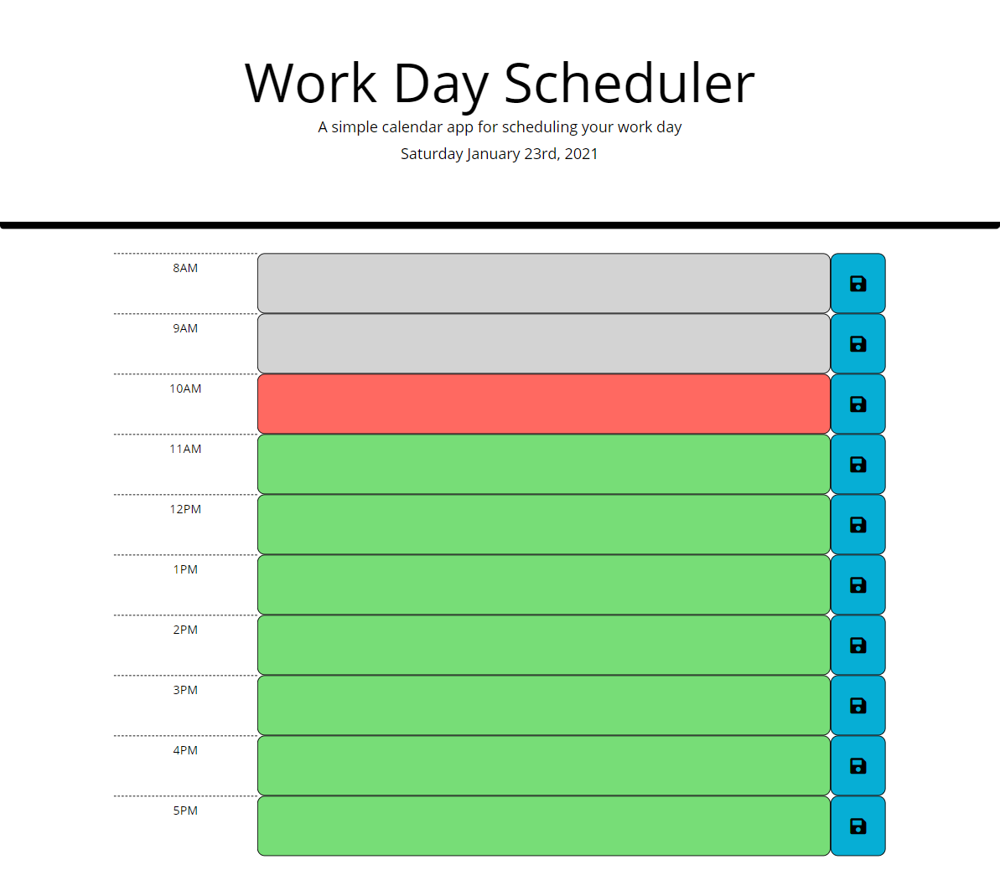

# Daily Planner
This daily planner features HTML, CSS and Javscript with an emphasis on jQuery. Clients can input their daily schedule and save the information. The planner will display red, green, or neutral to represent the time of day and assist clients with the organiation of their tasks.

# GitHub Repository

https://github.com/kierajcullen/dailyplanner

# GitHub Live Site

https://kierajcullen.github.io/dailyplanner

# Webpage
Add animation

